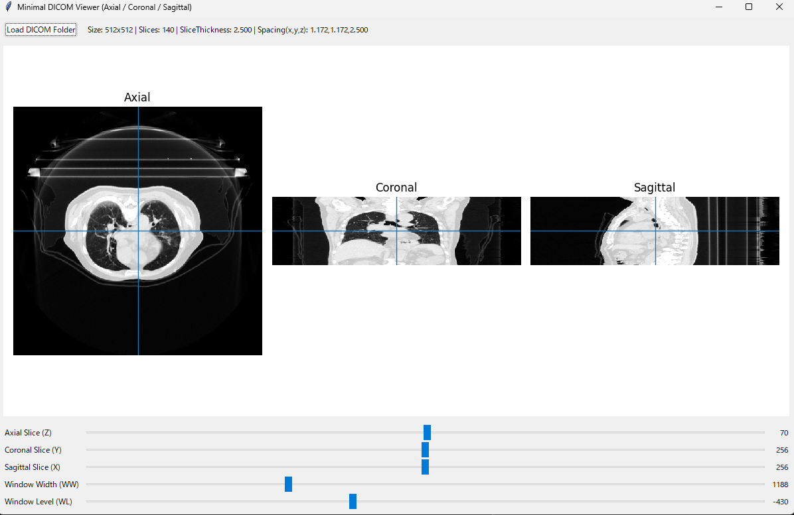

# DICOM Viewer 操作マニュアル

本ソフトは CT または MRI の DICOM 画像系列を読み込み，  
Axial・Coronal・Sagittal の3断面表示および各種パラメータ調整を行うための Viewer である。

---

## 1. 起動方法

- viewer.exe をダブルクリックして起動する  
- Viewer 画面が表示される  

---

## 2. DICOM 画像の読み込み

- 画面左上の **「Load DICOM Folder」** ボタンを押す  
- CT または MRI の DICOM ファイルが保存されているフォルダを選択する  
- 読み込みが完了すると，3断面画像が表示される  

---

## 3. 画面構成

| 項目 | 説明 |
|------|------|
| Axial | 横断面画像（必須表示） |
| Coronal | 前額断面画像 |
| Sagittal | 矢状断面画像 |
| 上部情報表示 | 画像サイズ・スライス枚数・スライス厚・画素間隔などの情報 |

---

## 4. スライス位置の変更

下部のスライダーにより表示する断面位置を変更できる。

| スライダー | 説明 |
|-----------|------|
| Axial Slice (Z) | Z方向のスライス番号を変更 |
| Coronal Slice (Y) | Y方向の断面位置を変更 |
| Sagittal Slice (X) | X方向の断面位置を変更 |

各画像に表示されている十字線は，他の断面位置を示している。

---

## 5. Window 調整

CT画像の表示濃度を調整する機能である。

| スライダー | 説明 |
|-----------|------|
| Window Width (WW) | コントラスト幅を変更 |
| Window Level (WL) | 表示中心値を変更 |

これにより骨・軟部組織などの見え方を調整できる。

---

## 6. 表示される情報

画像読み込み後，画面上部に以下の情報が表示される。

- 画像サイズ（Rows × Columns）
- スライス枚数
- スライス厚
- 各方向の画素間隔（Spacing）

---

## 7. 終了方法

ウィンドウ右上の「×」ボタンを押して終了する。

---

## 8. 動作環境

本プログラムは実行ファイル形式で配布しており，  
追加のライブラリや特別な環境設定なしで動作する。

---

## 9. 注意事項

- DICOM 画像が複数枚含まれるフォルダを選択すること  
- 非対応の形式のファイルでは表示できない場合がある  

---

### 画像の準備

- `viewer_screen.png` の部分にスクリーンショット画像を配置する  
- README.md と同じフォルダに画像ファイルを保存する  
